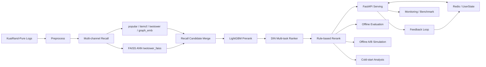

# End-to-End Short Video Recommendation System on KuaiRand-Pure

A production-style multi-stage short-video recommender with FAISS ANN retrieval, LightGBM pre-ranking, DIN multi-task ranking, real-time feedback serving, offline A/B simulation, and cold-start analysis.

## Overview

This repository turns **KuaiRand-Pure** into a full recommendation system project rather than a single-model demo. It includes:

- an offline multi-stage recommendation pipeline
- multi-channel recall with `popular`, `itemcf`, `twotower`, `graph_emb`, and `twotower_faiss`
- FAISS ANN retrieval with `IndexFlatIP`, `HNSW`, and `IVF`
- LightGBM pre-ranking and DIN-style multi-task ranking
- rule-based reranking for diversity, author frequency control, and freshness
- a FastAPI serving layer with optional Redis-backed user state and recommendation cache
- monitoring, local serving benchmark, offline A/B simulation, and cold-start analysis

Additional docs:

- [Deployment](docs/deployment.md)
- [Frontend Demo](docs/frontend_demo.md)
- [Resume Bullets](docs/resume_bullets.md)
- [System Design Notes](docs/system_design.md)
- [Interview Q&A](docs/interview_qa.md)
- [Project Report](docs/project_report.md)

## Architecture



## Core Capabilities

| Capability | Status | Main script / config | Key artifacts |
|---|---|---|---|
| Offline pipeline | Done | `scripts/01~08`, `configs/preprocess.yaml`, `configs/recall.yaml`, `configs/prerank.yaml`, `configs/rank.yaml`, `configs/rerank.yaml` | `processed/splits/*.parquet`, `artifacts/metrics/pipeline_report.json` |
| Multi-channel recall | Done | `scripts/02_train_recall.py`, `scripts/03_generate_recall_candidates.py`, `configs/recall.yaml` | `artifacts/recall/*`, `artifacts/metrics/recall_metrics.json` |
| FAISS ANN retrieval | Done | `scripts/09_build_faiss_index.py`, `scripts/10_test_faiss_recall.py`, `configs/faiss.yaml` | `artifacts/faiss/*`, `artifacts/metrics/faiss_benchmark.json` |
| Pre-rank | Done | `scripts/04_train_prerank.py`, `scripts/05_generate_prerank_topk.py`, `configs/prerank.yaml` | `artifacts/prerank/model.pkl`, `artifacts/prerank/test_topk.parquet` |
| Rank | Done | `scripts/06_train_rank.py`, `configs/rank.yaml` | `artifacts/rank/best_model.pt`, `artifacts/rank/test_ranked.parquet` |
| Rerank | Done | `scripts/07_run_rerank.py`, `configs/rerank.yaml` | `artifacts/rerank/test_final.parquet`, `artifacts/metrics/pipeline_report.json` |
| Online serving | Done | `scripts/11_run_serving.py`, `configs/serving.yaml` | `src/serving/*`, `/health`, `/recommend`, `/feedback`, `/metrics` |
| Interactive frontend demo | Done | `frontend/*`, `docs/frontend_demo.md` | React + Vite demo for `/recommend`, `/feedback`, `/health`, `/metrics` |
| Real-time feedback loop | Done | `scripts/12_test_realtime_feedback.py`, `configs/serving.yaml` | `artifacts/serving/feedback_log.jsonl`, `UserState`, cache invalidation |
| Redis cache | Optional fallback implemented | `configs/serving.yaml`, `docker-compose.yml` | Redis optional, memory fallback built in |
| Docker deployment | Configured | `Dockerfile`, `docker-compose.yml`, `docs/deployment.md` | `api + redis` compose stack |
| Monitoring and benchmark | Done | `scripts/15_benchmark_serving.py`, `configs/serving.yaml` | `artifacts/serving/request_log.jsonl`, `artifacts/serving/benchmark_report.json` |
| Offline A/B simulation | Done | `scripts/13_run_ab_test.py`, `configs/ab_test.yaml` | `artifacts/experiments/ab_test_report.json`, `ab_test_summary.md` |
| Cold-start analysis | Done | `scripts/14_cold_start_analysis.py`, `configs/cold_start.yaml` | `artifacts/analysis/cold_start_report.json`, `cold_start_summary.md` |

## Dataset

This project uses **KuaiRand-Pure**, a short-video recommendation dataset with:

- exposure logs instead of only explicit ratings
- multi-feedback signals such as click, long view, finish, and like
- item metadata such as `author_id`, `tag`, upload date, and aggregated statistics
- a natural fit for feed-style multi-stage recommendation

### Time-aware split

The pipeline uses a strict time-based split instead of random splitting:

- `train`: `date <= 20220424`
- `val`: `20220425 ~ 20220430`
- `test`: `date >= 20220501`

This is combined with a **point-in-time feature principle**:

- user history for ranking is built from past behavior only
- train / val / test are not mixed when constructing evaluation targets
- later interactions are not used to build earlier-stage user features

### Current local processed data

The numbers below come from the current local `processed/` artifacts:

| Split | Rows | Users | Unique items |
|---|---:|---:|---:|
| train | 1,208,280 | 26,469 | 7,542 |
| val | 94,784 | 21,184 | 5,564 |
| test | 133,545 | 22,709 | 5,722 |

Other local processed artifacts:

- item feature rows: `7,583`
- user sequence rows: `26,469`

## Pipeline Usage

Note: many scripts support `--processed-dir` and `--artifacts-dir` overrides. If your local paths differ from `configs/default.yaml`, pass overrides explicitly.

### 1. Preprocess

```bash
python scripts/01_preprocess.py --config configs/preprocess.yaml
```

### 2. Train recall branches

```bash
python scripts/02_train_recall.py --config configs/recall.yaml
```

### 3. Generate merged recall candidates

```bash
python scripts/03_generate_recall_candidates.py --config configs/recall.yaml
```

### 4. Build FAISS indices

```bash
python scripts/09_build_faiss_index.py --config configs/faiss.yaml
```

### 5. Benchmark FAISS recall

```bash
python scripts/10_test_faiss_recall.py --config configs/faiss.yaml
```

### 6. Train and infer pre-rank

```bash
python scripts/04_train_prerank.py --config configs/prerank.yaml
python scripts/05_generate_prerank_topk.py --config configs/prerank.yaml
```

### 7. Train rank model

```bash
python scripts/06_train_rank.py --config configs/rank.yaml
```

### 8. Run rerank and summarize pipeline

```bash
python scripts/07_run_rerank.py --config configs/rerank.yaml
python scripts/08_evaluate_pipeline.py --config configs/rerank.yaml
```

### 9. Start online serving

```bash
python scripts/11_run_serving.py \
  --config configs/serving.yaml \
  --processed-dir ./processed \
  --artifacts-dir ./artifacts \
  --host 127.0.0.1 \
  --port 8000
```

### 10. Test realtime feedback loop

```bash
python scripts/12_test_realtime_feedback.py \
  --base-url http://127.0.0.1:8000 \
  --user-id 0 \
  --top-k 5
```

### 11. Interactive frontend demo

Start the backend:

```bash
python scripts/11_run_serving.py \
  --config configs/serving.yaml \
  --processed-dir ./processed \
  --artifacts-dir ./artifacts \
  --host 127.0.0.1 \
  --port 8000
```

Start the frontend:

```bash
cd frontend
npm install
npm run dev
```

Open:

```text
http://localhost:5173
```

The frontend talks to the backend through `VITE_API_BASE_URL`, which defaults to `http://127.0.0.1:8000`. More detail is in [docs/frontend_demo.md](docs/frontend_demo.md).

### 12. Local serving benchmark

```bash
python scripts/15_benchmark_serving.py \
  --base-url http://127.0.0.1:8000 \
  --num-requests 50 \
  --concurrency 5 \
  --top-k 5
```

### 13. Offline A/B simulation

```bash
python scripts/13_run_ab_test.py \
  --config configs/ab_test.yaml \
  --processed-dir ./processed \
  --artifacts-dir ./artifacts
```

### 14. Cold-start analysis

```bash
python scripts/14_cold_start_analysis.py \
  --config configs/cold_start.yaml \
  --processed-dir ./processed \
  --artifacts-dir ./artifacts
```

### 15. Docker deployment

```bash
docker compose up --build
```

Detailed deployment notes are in [docs/deployment.md](docs/deployment.md).

## Metrics Summary

All metrics below come from existing local artifacts in `artifacts/`.

### Offline pipeline

| Stage | Metric | Val | Test |
|---|---|---:|---:|
| Recall | Recall@50 | 0.1832 | 0.1731 |
| Recall | Recall@100 | 0.2476 | 0.2343 |
| Recall | Recall@200 | 0.3151 | 0.2973 |
| Recall | Coverage | 0.9995 | 0.9996 |
| Pre-rank | Recall retained@100 | 0.6600 | 0.6315 |
| Rank | rank_auc | 0.5753 | 0.5845 |
| Rank | long_watch_auc | 0.5746 | 0.5838 |
| Rank | finish_auc | 0.6596 | 0.6663 |
| Rank | like_auc | 0.6201 | 0.6219 |
| Rank | NDCG@20 | 0.0295 | 0.0359 |
| Rerank | NDCG@20 before | 0.03635 | 0.04605 |
| Rerank | NDCG@20 after | 0.03636 | 0.04623 |
| Rerank | delta NDCG@20 | +0.0000117 | +0.0001823 |
| Rerank | avg unique tags / user delta | +0.3091 | +0.3023 |

Interpretation:

- recall and pre-rank provide most of the candidate filtering
- DIN ranker improves fine-grained ordering but absolute NDCG is still moderate
- rerank is doing what it should: small relevance change, measurable diversity gain

### FAISS benchmark

Current benchmark compares `IndexFlatIP` with `HNSW` on `top_k=500`.

| Index | Mean latency (ms) | P95 latency (ms) | Index size (bytes) |
|---|---:|---:|---:|
| FlatIP | 0.8636 | 0.8543 | 1,941,293 |
| HNSW | 0.7151 | 0.8091 | 4,002,390 |

Additional FAISS metrics:

- mean overlap@500 vs FlatIP: `0.8352`
- p95 overlap@500: `0.9060`
- mean latency speedup vs FlatIP: `1.21x`

Interpretation:

- HNSW is faster on average in the current local benchmark
- overlap is good enough for a practical ANN branch, but not exact

### Serving benchmark

These numbers come from a **local** benchmark, not a production load test.

| Metric | Value |
|---|---:|
| Requests | 50 |
| Concurrency | 5 |
| Success count | 50 |
| QPS | 1.7394 |
| Mean latency | 2822.39 ms |
| P50 latency | 2871.64 ms |
| P95 latency | 3245.20 ms |
| P99 latency | 3282.12 ms |
| Cache hit rate | 0.02 |
| Redis connected during benchmark | false |

Average per-stage latency from the same server snapshot:

- recall: `56.87 ms`
- prerank: `1180.22 ms`
- rank: `1480.71 ms`
- rerank: `100.65 ms`

Interpretation:

- the current online stack is functionally complete
- the main latency bottlenecks are pre-rank and rank feature/inference stages
- the benchmark was run locally with Redis unavailable, so memory fallback was used

### Offline A/B simulation

This is an **offline log-replay simulation**, not a real online A/B test.

Control:

- `popular`

Treatment:

- `full_pipeline`

Current test-split summary:

| Metric | Control | Treatment | Relative lift |
|---|---:|---:|---:|
| long_view_rate@10 | 0.007492 | 0.006921 | -7.62% |
| hit_rate@10 | 0.070197 | 0.065845 | -6.20% |
| recall@50 | 0.086977 | 0.132197 | +51.99% |
| ndcg@50 | 0.038862 | 0.044551 | +14.64% |
| coverage@10 | 0.003033 | 0.214031 | +6956.52% |

Bootstrap result for the primary metric:

- primary metric: `long_view_rate@10`
- observed relative lift: `-7.62%`
- bootstrap 95% CI: `[-0.1606, 0.0151]`

Interpretation:

- the full pipeline did **not** clearly beat `popular` on the primary metric in this offline replay
- it did improve deeper recall, ranking depth, and coverage materially
- this is a useful trade-off discussion point, not a result to exaggerate

### Cold-start analysis

This is a **heuristic cold-start simulation**, not a learned cold-start model.

User segment distribution in the current test split:

| Segment | Users | Impressions |
|---|---:|---:|
| new_user | 1,279 | 6,219 |
| low_active_user | 2,992 | 11,631 |
| medium_active_user | 5,969 | 28,193 |
| high_active_user | 12,469 | 87,502 |

Cold-start enhancement strategies:

- `global_popular`
- `category_popular`
- `freshness_boost`

Current user-segment lift summary:

| Segment | hit_rate@10 lift | recall@50 lift | long_view_rate@10 lift | coverage@10 lift |
|---|---:|---:|---:|---:|
| new_user | +48.84% | +15.49% | +64.13% | -13.24% |
| low_active_user | +17.39% | -3.78% | +23.24% | -26.92% |
| medium_active_user | +5.60% | +6.36% | +7.25% | -2.40% |
| high_active_user | +0.64% | +1.54% | +0.30% | -0.50% |

Interpretation:

- cold-user quality improves clearly, especially for `new_user`
- the trade-off is lower coverage because more traffic shifts toward popular / category-popular content
- item cold-start is still weak; most recommendations remain concentrated on `popular_item`

## Project Highlights

- Integrated FAISS ANN retrieval into a multi-stage recommendation pipeline instead of keeping Two-Tower as a standalone offline embedding model.
- Built a full online serving path with `/health`, `/recommend`, `/feedback`, `/metrics`, and `/metrics/prometheus`, plus degraded mode when some artifacts are missing.
- Implemented a realtime feedback loop with `UserState`, recent-view filtering, recommendation cache invalidation, and optional Redis with memory fallback.
- Added lightweight in-process monitoring, structured request logs, and a local benchmark flow that surfaces stage-level latency bottlenecks.
- Added offline log-replay A/B simulation with user-level bucketing and bootstrap CI, and documented clearly that it is not a real online experiment.
- Added cold-start cohort analysis that shows where heuristic enhancements help and where they trade coverage for short-term quality.
- Preserved time-aware data splitting and leakage prevention through the ranking pipeline and offline evaluation path.

## Known Limitations

- Offline A/B simulation is **not** a real online A/B test and does not estimate causal lift.
- Serving benchmark is local only; it is **not** a production load test.
- The cold-start strategy is heuristic and offline; it is not a learned cold-start model.
- Docker Compose files were prepared, but Docker was not available on the current machine during development, so full container validation was not completed here.
- Realtime feedback is a serving-state simulation; it does not feed an actual model retraining loop yet.
- Item cold-start is still weak even after heuristic enhancement.
- Some lower-stage artifacts, such as `artifacts/recall/test_candidates.parquet`, may exist only as Git LFS pointers instead of materialized parquet files.
- Online latency is currently high for a true production system, especially in pre-rank and rank stages.
- The current serving feature store is still local parquet-based, not an online feature platform.

## Roadmap

- Validate the Compose stack in a real Docker + Redis environment.
- Add Prometheus + Grafana dashboards on top of the current metrics endpoints.
- Add content-based or metadata-based cold-item recall for real item cold-start coverage.
- Introduce a proper online feature store instead of local parquet-backed feature loading.
- Add IPS / DR style debiased offline evaluation.
- Build a true retraining loop from feedback logs to refreshed model artifacts.
- Compare DIN with stronger rankers such as Transformer ranker, DCN, or DeepFM.

## Repository Layout

```text
configs/
scripts/
src/
  analysis/
  data/
  experiments/
  prerank/
  rank/
  recall/
  rerank/
  serving/
  utils/
docs/
processed/
artifacts/
```
